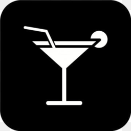

<!-- PROJECT LOGO -->
<br />
<div align="center">
  <a href="https://github.com/othneildrew/Best-README-Template">
    
  </a>

  <h3 align="center">Drink Stop</h3>

  <p align="center">
    
</div>

<!-- ABOUT THE PROJECT -->

## About The Project

Here is my final project called drink stop. drink stop is an online store that allows customers to buy a variety of alcoholic drinks. When you enter the website, you need to log in with a username to make the orders. Also, an admin type user has the option to edit the drinks, the inventory, look at the orders and of course edit users. The store is responsive so it can also be used on mobile.
The project has a client side and a server side, so you need to run and download the libraries on both sides. There are details later in the document on how to do this.
The project was built by React Js and Node.

### Run the project

#### Server

Open a terminal on the `server` folder

Install the dependencies:

```
npm i
```

Run the server:

```
npm start
```

#### Client

Open a terminal on the `client` folder
Install the dependencies:

```
npm i
```

Run the client:

```
npm start
```
